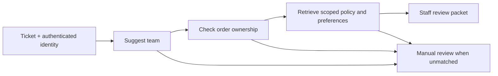

# Business template: retail customer-service desk

**Business problem:** support agents switch between a ticket, company policies,
order records, and customer notes before they can respond. This template prepares
one review packet with relevant evidence and a suggested team.

**Example business:** Northstar Home, a fictional online homewares retailer.
Harbor Goods is a second fictional business used to test data separation.

**User:** a support agent handling returns and delivery enquiries.

**Intended benefit:** reduce context-gathering time and misrouted tickets. No time
savings, answer accuracy, or commercial ROI have been measured yet.

## A concrete customer journey

Alice asks: **“I want to return my blender for a refund.”** The application has
authenticated her and supplies her customer and business identifiers, along with
ticket and order references.

The template:

1. Suggests the returns team using a CLM router.
2. Looks up the order using the business and customer identity. An order number
   alone never grants access.
3. Retrieves that business's returns policy, with its source and revision.
4. Recalls only that customer's contact preferences within that business.
5. Produces a packet for a staff member to review and act on.



The packet provides **order facts and policy evidence**. It does not infer refund
eligibility from embedding similarity. Staff still verify product condition,
dates, exceptions, and current policy before deciding what to do.

## Run the working demo

Follow the [environment setup](USE_CASES.md#get-the-templates) to clone the current
repository and install the released `v0.1.0a1` core. Then run:

```bash
python templates/retail_service_desk.py
```

This prints JSON for fictional tickets. It runs locally with NumPy, without API
credentials or model downloads. The script is standalone and can be copied into
your application. It was added after the alpha release; get the file from `main`,
not from the existing release archive.

The demo and its regression tests cover these scenarios:

| Scenario | Expected result |
|---|---|
| Alice returns her Northstar Home blender, order `N-1001` | Returns packet with her order, Northstar policy sources and her preferences |
| Delivery enquiry for an owned order | Delivery packet with delivery policy evidence |
| A customer also named Alice at Harbor Goods | Only Harbor Goods context, despite having the same customer identifier |
| Someone else's order or an unknown order | The same generic manual-review result; no order, policy or preference disclosure |
| Unrelated or blank request | Manual review with no business action |
| Relevant policy cannot be found | Manual review rather than an unsupported answer |

Inspect `cases` in the output. A matched packet has `status: "staff_review"`,
`queue: "returns"` or `"delivery"`, and populated `policy_evidence`,
`order_context`, and `customer_preferences` when relevant. Escalation uses
`status: "escalated"` and `queue: "manual_review"`. Every result requires human
review and reports `action_executed: false`.

These are structured staff notes, not generated customer replies. No ticket is
created in a live helpdesk, no email is sent, and no refund is issued.

## Reuse it in an application

In a Python file alongside a copied `retail_service_desk.py`:

```python
from retail_service_desk import RetailServiceDesk

desk = RetailServiceDesk()
packet = desk.prepare_case(
    "I want to return my blender for a refund",
    ticket_id="T-1001",
    order_id="N-1001",
    trusted_tenant_id="north",      # derive from authenticated application context
    trusted_customer_id="alice",    # never let an LLM choose either trusted ID
)
```

`RetailServiceDesk(encoder=...)` accepts a different clmkit encoder. Its
`route_threshold`, `policy_min_score`, and `preference_min_score` settings are
illustrative values for this synthetic hashing example, not confidence
probabilities. Tune them on separate business data when replacing the encoder.

The template trusts the two identity arguments; it does not authenticate users.
Expose a server endpoint that derives those IDs from the session, rather than a
model tool with editable identity fields.

For a staff-facing helpdesk, also verify that the signed-in staff member may
access this business, ticket and customer, and that the ticket belongs to that
customer. Supply the customer identity from that checked association.

## Replace the demo inputs

| Demo input | Business replacement | Rule to retain |
|---|---|---|
| Fictional returns/delivery policies | Approved, versioned company policy passages | Filter by business and topic; preserve title, source URL and revision |
| In-memory sample orders | Read-only order service, CRM or ERP adapter | Authorize by business and customer before returning order facts |
| Sample contact preferences | Customer-approved profile notes | Scope both business and customer, including on writes |
| Example routing utterances | Labelled historical ticket intents | Include ambiguous and out-of-domain tickets in evaluation |
| Printed JSON | Staff dashboard or helpdesk draft | Keep approval and action execution in the host application |

The order dictionary is a deterministic lookup. CLM components select a topic,
find policy passages and recall preferences; they are not the source of truth
for purchases or permissions. There is no Odoo, Shopify, or other live-system
connector in this template. Adding one requires its own integration tests.

Retrieved documents and notes remain untrusted text. If you add a reply generator,
supply them as context rather than instructions, require source-backed claims,
and evaluate generated answers separately.

## Tests and pilot acceptance

```bash
python -m pip install pytest
python -m pytest -q tests/test_retail_service_desk.py
```

Tests cover routes and evidence, customer/business separation, unauthorized and
missing-order handling, escalation, and the isolated JSON CLI. They run in the
same core and installed-wheel CI matrices as the other templates.

For a pilot, first use a held-out set of historical tickets with approved answers
and policy sources. Record a baseline with the manual process, then compare:

| Measure | How to assess it |
|---|---|
| Context-gathering time | Time until an agent has the correct order and policy |
| Correct team selection | Compare selected queues with reviewer labels |
| Policy retrieval quality | Check whether the right current policy appears in returned evidence |
| Escalation quality | Measure missed escalations and unnecessary manual review |
| Data separation | Attempt cross-customer and cross-business access; require no disclosure |
| Staff usefulness | Record edits, missing facts and whether agents use the packet |

Set acceptance thresholds before the pilot. Start with staff-visible suggestions
and read-only integrations; expand based on measured results. Hashing tests prove
the sample workflow's mechanics, not semantic quality or production readiness.
See [validation limits](VALIDATION_STATUS.md).
