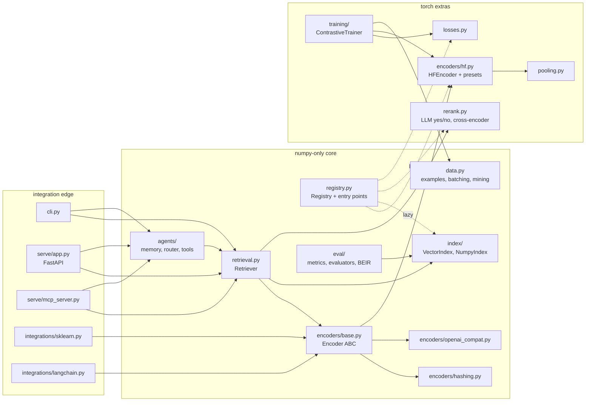

# Design & architecture

## Scope: what "CLM" means here

**Contrastive Language Model (CLM)**: a language model trained with a contrastive objective to produce text representations. Paired texts (query ↔ relevant passage, sentence ↔ paraphrase) are pulled together and unrelated ones pushed apart. In practice this means **bi-encoder embedding models** such as Qwen3-Embedding, E5, BGE and GTE, often paired with a **reranker** (cross-encoder or LLM-as-judge) for second-stage precision.

The name is also used for two other things that are **out of scope** for v0.1 (see the [gap analysis](GAP_ANALYSIS.md)):

- *Contrastive decoding*, an inference-time trick that contrasts an expert and an amateur generative LM. It's a different problem: it concerns generation, not representation.
- *CLIP-style multimodal contrastive models* (text ↔ image). The `Encoder` interface has no text-only assumptions beyond its input type, so a multimodal encoder is a natural extension (for example Qwen3-VL-Embedding).

## Design principles

1. **Skeleton, not monolith.** Every major piece is an interface with one or two solid implementations: `Encoder`, `VectorIndex`, `Reranker`, loss protocol, evaluator callable. Users swap pieces without forking.
2. **Numpy-only core; heavy backends are lazy.** `import clmkit` never imports torch. `transformers`, `peft`, `fastapi`, `faiss` and `mcp` load only when the component that needs them is built. CI enforces this.
3. **Correct by default for real models.** Pooling, padding side, prompt templates and EOS handling are *model-specific* and easy to get silently wrong, so they live in presets and are verified against reference implementations.
4. **Readable training loop.** No trainer framework. `ContrastiveTrainer.train()` reads top to bottom, and GradCache is ~40 lines.
5. **Safe persistence and serving.** No pickle (NumPy `allow_pickle=False` + JSON), `yaml.safe_load`, `trust_remote_code=False`, localhost binding, optional auth, request limits, writes off by default.
6. **Framework-agnostic agent integration.** Tools are plain JSON Schema + Python callables, exported to Anthropic/OpenAI formats and MCP. There's no dependency on any agent framework.

## Module map



## Key abstractions

### `Encoder` (`encoders/base.py`)

Subclasses implement two things: `native_dim` and `_encode(formatted_texts, batch_size) -> ndarray`. The base class handles everything else, so every backend behaves identically:

- **asymmetric prompts**: `query_template` / `document_template` with `{instruction}` / `{text}`; per-call or per-example instructions;
- **Matryoshka truncation** (`dim=` per call or `output_dim` per encoder) followed by **L2 normalisation**, so dot product equals cosine;
- input validation, `str` vs `list[str]`, empty input, shape checks;
- a versioned `fingerprint()` of vector-producing configuration, stored with indexes and checked at lifecycle boundaries; it does not hash weights on every query.

Implementations: `HFEncoder` (transformers), `OpenAICompatibleEncoder` (stdlib HTTP), and `HashingEncoder` (deterministic feature hashing, a zero-download baseline for tests, CI and demos).

### Presets (`encoders/presets.py`)

A `ModelPreset` is chosen by glob match on the model id, or by a `clmkit_config.json` next to a checkpoint. The Qwen3 preset encodes a subtle fact: the tokenizer's `eos_token` is `<|im_end|>`, but embeddings are pooled from `<|endoftext|>`. The encoder guarantees that token is last, without duplicating it when the tokenizer already appends it.

### `VectorIndex` (`index/`)

The index stores `(id, vector)` pairs only; text and metadata live in the `Retriever`. That keeps indexes swappable, since a vector DB adapter only needs `add/search/remove/save/load`. `NumpyIndex` is exact and chunked with argpartition top-k. `FaissIndex` supports flat and HNSW. Filtering is expressed as `allowed_ids`.

### `Retriever` (`retrieval.py`)

Encoder + index + document store, with an optional reranker. Metadata filters can be an equality dict or a predicate. Reranking over-fetches `rerank_candidates` (default `4k`) and keeps the first-stage score in `metadata["retrieval_score"]`. Persistence is a directory (`index/`, `documents.jsonl`, `retriever.json`).

The retriever records the configuration fingerprint and optional
`encoder_identity` that produced its vectors. The fingerprint includes model
configuration, dimensions and query/document formatting; the HF encoder adds
revision, adapter, tokenizer, pooling and truncation settings. It cannot prove
that mutable local weights or an in-memory model have remained unchanged.
`encoder_identity` is a caller-supplied immutable artifact identifier, such as
a digest of a weights/adapter manifest. Supply the same value at construction
and reload, and generate a new value whenever those artifacts change. clmkit
compares the identifier; it does not establish its authenticity or derive it
automatically from training updates.

`validate_encoder()` compares the current configuration and declared identity
with the indexed values. `add()` and `save()` invoke this check; callers should
also invoke it after changing a live encoder. Search does not repeat the
configuration hash on each request. A mismatch on a nonempty index requires
re-encoding all documents into a new retriever at a separate snapshot path.
Validate that snapshot, then switch consumers while retaining the previous
complete version. Relabeling the saved metadata is not a rebuild, and multi-file
snapshot writes are not atomic.

`Retriever.load(path, encoder, encoder_identity=identity, strict=True)` rejects
configuration or identity mismatches. The Python default remains `strict=False`,
which permits warned reads; the CLI uses strict index checks by default. A
permissive load preserves the original vector provenance, so it cannot silently
append new vectors or save the old ones under a changed encoder identity.
Legacy snapshots with only a name/dimension fingerprint receive a shallow
comparison and warning; even a matching legacy snapshot needs a rebuild before
adding or saving existing vectors with current provenance. See the
[training guide](TRAINING.md#7-rebuild-retrieval-indexes-after-training) for the
rebuild workflow.

### Training (`losses.py`, `training/`)

- All losses share `loss(query, positive, negatives=None, scores=None)`, so the trainer is loss-agnostic. `MatryoshkaLoss` wraps any of them.
- `info_nce` builds candidates from in-batch positives plus **all** hard negatives in the batch. It optionally masks suspected false negatives (candidates scoring more than `margin` above the positive) and optionally adds the symmetric document→query term.
- `iter_batches` keeps duplicate queries and positives out of the same batch by default, because a duplicate positive becomes a guaranteed false negative.
- `ContrastiveExample.label` is an optional non-empty string describing the query/positive relevance class. `avoid_same_label=True` in `TrainConfig` or `iter_batches` requires every example to have a label and permits at most one of each label in an effective batch. It also retains text deduplication. Label-aware training rejects explicit negatives unless `max_negatives=0` disables them; their labels are not available to protect the entire loss candidate set. Unlabeled workflows retain their defaults.
- **GradCache**: (1) embed all chunks without a graph, saving RNG state; (2) compute the full-batch loss on detached embeddings to get ∂L/∂embedding; (3) re-embed each chunk with a graph and back-propagate the cached gradient. Tests assert the resulting parameter gradients equal full-batch gradients.
- LoRA uses `peft`. Checkpoints can be adapter-only (small; `HFEncoder` auto-loads base + adapter) or merged (plain checkpoint).

Label exclusions apply across all GradCache chunks because sampling happens
before chunking the effective batch. Direct `training_step` calls check labels
and repeated texts before either gradient path. This is a sampler constraint,
not a multi-positive loss mask or a guarantee that the supplied labels represent
semantic truth. It can produce smaller batches, including singleton batches
with no InfoNCE learning signal when explicit negatives are disabled.

### Hard-negative mining (`data.py`)

`mine_hard_negatives` computes scores in query/corpus blocks, controlled by the
Python keywords `query_block_size=128` and `corpus_block_size=4096`. Encoder
batching remains separately controlled by `batch_size=32`. The full corpus
embedding matrix stays resident; score buffers depend on the configured blocks
and retained candidate count rather than the full query-by-corpus product.
This bounds score computation memory, not total model/embedding/process memory.

The miner deduplicates corpus texts, ranks descending scores, and breaks ties by
first corpus occurrence. It retains a candidate window of
`skip_top + 3 * num_negatives + 1` before applying positive, existing-negative,
label and relative-score exclusions; it may therefore underfill the requested
negative count. Aligned `corpus_labels` are required when mining labelled
examples. All example/corpus labels must be present, conflicting text labels
are rejected, and existing negatives need known different-label corpus entries.
The returned examples preserve their labels but carry no negative-label loss
mask: safe label-aware training still uses `max_negatives=0`.

### Agents (`agents/`)

- `SemanticMemory`: a `Retriever` plus a creation timestamp. Scores decay as `cos * 0.5 ** (age / half_life)`. It supports `forget` and `forget_older_than`.
- `SemanticRouter`: routes defined by example utterances and/or a description, aggregated by max, mean or centroid. Global and per-route thresholds let you abstain (`None`) and fall back to an LLM.
- `ToolKit`: JSON Schema tools with a minimal validator (types, required, bounds, `maxLength`, enum, no extra args). `ToolError` messages are safe to show to the model.

### Registry and plugins (`registry.py`)

Four registries: `ENCODERS`, `INDEXES`, `RERANKERS` and `LOSSES`. Built-ins that need optional deps are registered **lazily by dotted path**. Third-party packages register via entry points:

```toml
[project.entry-points."clmkit.encoders"]
my-encoder = "my_pkg.encoders:MyEncoder"
```

## Data flow: a search request

1. `Retriever.search(q)` calls `encoder.encode(q, kind="query", instruction=…)`. The template is applied, then tokenize → forward → pool → truncate → normalise.
2. `index.search(qvec, pool, allowed_ids=filter(metadata))` returns top-k `(id, score)` pairs.
3. The optional `reranker.rerank(q, hits)` scores pairs jointly and re-sorts them.
4. `SearchHit(id, score, text, metadata)` objects are returned. The REST API, MCP tools and agent tools are thin shells over this.

## Decisions & trade-offs

| Decision | Why | Cost |
|---|---|---|
| numpy-only core, lazy torch | usable in agents and services without a 2 GB dependency; fast imports | a registry indirection |
| Own trainer instead of HF `Trainer` / sentence-transformers | GradCache + in-batch-negative semantics are explicit; ~350 readable lines | no DDP/FSDP yet (see gap analysis) |
| Exact NumPy index by default | zero deps, exact | O(N) per query; memory depends on dimensions and query chunking (1M × 4096 float32 vectors alone need 16.384 GB) |
| NumPy JSON + `.npy` with pickle disabled | avoids pickle deserialization for this backend | native FAISS files still require trusted provenance |
| stdlib HTTP client for remote encoders | no `requests`/`httpx` dependency | fewer conveniences (we implement retry/backoff) |
| Refuse HTTP redirects in the remote client | `urllib` forwards `Authorization` across hosts | a server behind a redirect needs its final URL |
| Global lock around the model in the REST server | torch modules aren't guaranteed thread-safe | one forward at a time per process; multiple workers need an explicit shared-state/durability design |
| fp32 on CPU for `dtype="auto"` | transformers v5 defaults to the checkpoint dtype (bf16), which is slow and less precise on CPU | more RAM on CPU |
